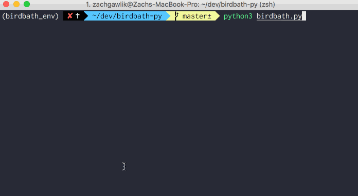

# Birdbath

Command-line application for rapidly reviewing and deleting your past tweets.

## Installation

1. Clone the repository
2. (optionally) Create and activate a new virtual Python environment
3. Install the necessary libraries: `pip install -r requirements.txt`
4. [Create a new Twitter App](https://apps.twitter.com/) with no Callback URL. Ensure the app has both Read and Write permissions
5. Paste the consumer key and consumer secret in the respective placeholder in `configEXAMPLE.py` and rename the file to `config.py`
6. Run `python3 birdbath.py`

